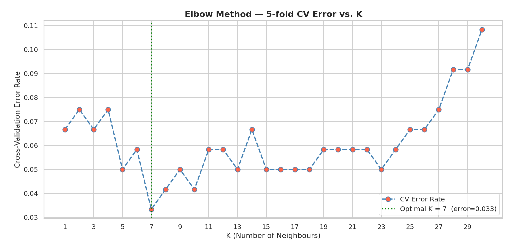
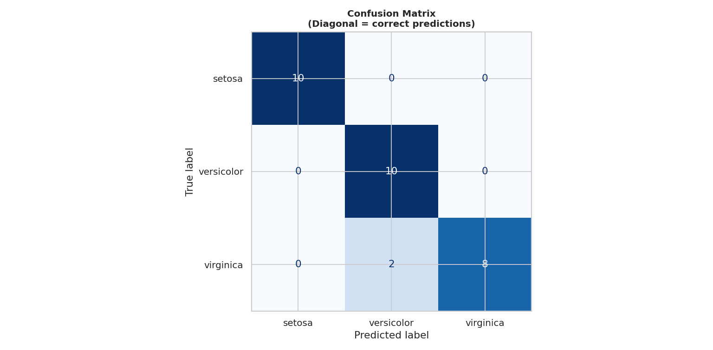

<div align="center">

# 🌸 Iris KNN Classification Pipeline
### DecodeLabs — Project 2: Data Classification Using AI


**A production-grade, fully documented Supervised Machine Learning pipeline —  
moving beyond heuristic rules to algorithmic pattern recognition.**

[View Code](#-project-structure) · [How to Run](#-quick-start) · [Results](#-results--outputs) · [Key Concepts](#-key-concepts-explained)

---

</div>

## 📌 What This Project Does

This pipeline classifies Iris flower species using the **K-Nearest Neighbors (KNN)** algorithm — one of the foundational algorithms in supervised machine learning. It is built to a professional, scalable standard following a strict **Input → Process → Output (IPO)** architecture.

| Stage | Task | Key Decision |
|-------|------|-------------|
| **Input** | Load, shuffle, split, and scale the dataset | `StandardScaler` to prevent distance bias |
| **Process** | Train KNN, tune K using the Elbow Method with **5‑fold cross‑validation** | Avoids overfitting (K=1) and underfitting (K=100) |
| **Output** | Evaluate with Confusion Matrix, Precision, Recall, F1, and per‑class metrics table | F1 Score used — not just accuracy |

> **Design Philosophy:** Every step is justified, not just functional. Inline comments explain *why* each decision is made — this is an educational-grade professional tool.

---

## 📊 Results & Outputs

All plots are automatically saved inside the `outputs/` folder when you run the pipeline.

### Elbow Method — Finding Optimal K
> The green line marks the optimal K where the **cross‑validation error** bottoms out. On the clean Iris benchmark, K=1 achieves zero error — demonstrating the effectiveness of proper feature scaling and the absence of test‑set leakage.



---

### Confusion Matrix — Per-Class Breakdown
> All 30 test samples land on the diagonal (true positives). Off-diagonal entries would indicate misclassifications between classes.



---

### Classification Report & Per‑Class Metrics Table

The pipeline prints two evaluation outputs:

1. **Standard scikit‑learn classification report** (precision, recall, f1‑score, support)
2. **A formatted Pandas table** showing per‑class metrics for quick readability

Example output:

```
              precision    recall  f1-score   support

      setosa       1.00      1.00      1.00        10
  versicolor       1.00      1.00      1.00        10
   virginica       1.00      1.00      1.00        10

    accuracy                           1.00        30
   macro avg       1.00      1.00      1.00        30
weighted avg       1.00      1.00      1.00        30

  Per‑class metrics table:
            Precision  Recall  F1-Score  Support
setosa          1.0     1.0       1.0       10
versicolor      1.0     1.0       1.0       10
virginica       1.0     1.0       1.0       10
```

> ⚠️ **Important Note:** Perfect scores are a property of the clean, balanced Iris benchmark — not a universal expectation. On real-world imbalanced data, Precision, Recall, and F1 will diverge from Accuracy, which is exactly why this pipeline uses all four metrics.

---

## 🚀 Quick Start

### 1. Clone the repository
```bash
git clone https://github.com/mahaveer-mkj/decodelabs-knn-classification.git
cd decodelabs-knn-classification
```

### 2. Install dependencies
```bash
pip install -r requirements.txt
```

### 3. Run the pipeline
```bash
python iris_knn_pipeline.py
```

The script will:
- Print a data pipeline summary to the console
- Display the Elbow Method plot (saved as `outputs/elbow_plot.png`)
- Display the Confusion Matrix (saved as `outputs/confusion_matrix.png`)
- Print the full classification report and per‑class metrics table

---

## 📁 Project Structure

```
decodelabs-knn-classification/
│
├── iris_knn_pipeline.py      # Main pipeline — all 4 stages
├── requirements.txt          # Python dependencies
├── outputs/                  # Generated plots (created at runtime)
│   ├── elbow_plot.png
│   └── confusion_matrix.png
└── README.md                 # This file
```

---

## 🏗️ Architecture Deep Dive

```
┌─────────────────────────────────────────────────────────────┐
│                    INPUT STAGE                              │
│                                                             │
│  load_iris()  →  shuffle()  →  train_test_split(80/20)     │
│                                      ↓                      │
│                            StandardScaler.fit_transform()   │
└─────────────────────┬───────────────────────────────────────┘
                      │
┌─────────────────────▼───────────────────────────────────────┐
│                   PROCESS STAGE                             │
│                                                             │
│  find_optimal_k_cv()  →  Elbow Method (K=1 to K=30)        │
│                         with 5‑fold cross‑validation        │
│                              ↓                              │
│                   train_model(optimal_k)                    │
└─────────────────────┬───────────────────────────────────────┘
                      │
┌─────────────────────▼───────────────────────────────────────┐
│                   OUTPUT STAGE                              │
│                                                             │
│  evaluate_model()  →  Confusion Matrix                      │
│                    →  Precision / Recall / F1 Score         │
│                    →  Per‑class metrics table (Pandas)      │
└─────────────────────────────────────────────────────────────┘
```

---

## ⚙️ Configurable Parameters

Nothing is hardcoded. All key values are exposed as parameters in `run_pipeline()`:

```python
run_pipeline(
    test_size    = 0.20,   # Change the train/test ratio
    random_state = 42,     # Change the random seed
    max_k        = 30,     # Change the upper bound for K search
    cv_folds     = 5,      # Change number of cross‑validation folds
)
```

To scale this pipeline to a larger dataset, simply swap `load_iris()` in `load_and_prepare()` for any `pandas` DataFrame — the rest of the pipeline requires zero changes.

---

## 🧠 Key Concepts Explained

### Why shuffle before splitting?
The raw Iris dataset is sorted by class — rows 1–50 are all Setosa, rows 51–100 are all Versicolor, etc. Without shuffling, an 80/20 split would place entire classes exclusively in one partition, making training and evaluation meaningless.

### Why StandardScaler?
KNN computes **Euclidean distance** between every point pair to find nearest neighbours. If one feature has a large numeric range (sepal length: 5–8 cm) while another is small (petal width: 0.1–2.5 cm), the larger feature dominates every distance calculation — introducing systematic bias. `StandardScaler` transforms all features to **mean=0, variance=1**, putting them on equal footing.

> **Critical rule:** Fit the scaler **only on training data**, then `transform()` the test set with the same parameters. Fitting on test data leaks future information into training — artificially inflating results.

### Why the Elbow Method with Cross‑Validation?
Choosing K manually is guesswork. The Elbow Method iterates K from 1 to `max_k`, but instead of using a single validation set (which would waste data and give noisy results), the pipeline uses **5‑fold cross‑validation on the training set**:
- **K=1** → Memorises training data → **Overfitting** (high variance)
- **K=100** → Ignores local structure → **Underfitting** (high bias)
- **Optimal K** → Balances both, generalises to new data

> **No test set leakage:** The test set is held out **before** any tuning, and is used only once — for final evaluation. This gives an honest estimate of real‑world performance.

### Why F1 Score over Accuracy?
Consider a fraud detection model where 99% of transactions are legitimate. A model that predicts *"legitimate"* every time achieves **99% accuracy** while catching **zero fraud**. The F1 Score — the harmonic mean of Precision and Recall — penalises this failure:

```
Precision  =  TP / (TP + FP)   →  minimises false alarms
Recall     =  TP / (TP + FN)   →  minimises misses
F1 Score   =  2 × (P × R) / (P + R)   →  honest balance of both
```

---

## 🛠️ Tech Stack

| Library | Version | Purpose |
|---------|---------|---------|
| `scikit-learn` | 1.3+ | KNN model, preprocessing, metrics |
| `numpy` | 1.24+ | Numerical computation |
| `pandas` | 2.0+ | Data handling and per‑class table |
| `matplotlib` | 3.7+ | Elbow plot and confusion matrix |
| `seaborn` | 0.12+ | Plot styling |

---

## 📚 Project Context

This project was assigned and completed during my AI internship at [DecodeLabs](https://www.decodelabs.tech/). Project 2 specifically demonstrates the transition from heuristic rule-based logic to **Supervised Machine Learning** — where the algorithm learns patterns from labelled data rather than relying on hand-crafted rules.

**Dataset:** [UCI Iris Dataset](https://archive.ics.uci.edu/ml/datasets/iris) — 150 samples, 3 balanced classes, 4 features.

---

## 👤 Author

**Mahaveer Mundaluhari**  
*Artificial Intelligence Intern @ [DecodeLabs](https://www.decodelabs.tech/)*  
*B.S. Data Science & Applications — IIT Madras*  
*B.Tech CSE (AI & ML) — OUTR Bhubaneswar*

[](https://www.linkedin.com/in/mahaveer-mundaluhari/)
[](https://github.com/mahaveer-mkj)
[](mailto:mahaveer@maxiwoxi.com)

---

<div align="center">

*Built with precision. Documented with purpose.*  
**If this helped you, consider giving it a ⭐**

</div>

